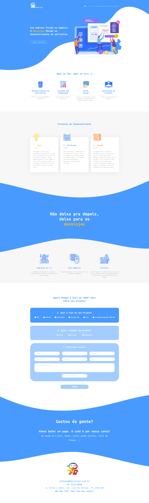

  

# < front >Developer</ end >

Objetivo deste desafio é avaliarmos o seu domínio em front-end, ou seja, sua organização, estilo e boas práticas com o código, conhecimento dos frameworks e tecnologias utilizadas.

## As regras do jogo

1. Todo o seu código deve ser disponibilizado num repositório **público** ou **privado** em seu Github, Gitlab ou Bitbucket 
pessoal. Envie um email para contato@devninjas.com.br com o assunto Desafio Front-end Developer - [SEU NOME] contendo o link para o repositório que você criou ou faça um pull-request.

2. Desenvolver o projeto utilizando:  

- HTML e CSS (ou algum pré-processador)
- Use o framework CSS com o qual você se sente mais confortável
- Layout responsivo

3. Crie um arquivo README que explique como rodar o projeto, como executar quaisquer scripts necessários.

## O Desafio

Este é o layout que deverá ser desenvolvido:

E aqui os ícones e imagens do layout:

[Download do arquivo](mockup)

## Para onde enviar seu repositório

Todo o seu código deve ser disponibilizado num repositório **público** ou **privado** em seu Github, Gitlab ou Bitbucket 
pessoal. Envie um email para contato@devninjas.com.br com o assunto Desafio Front-end Developer - [SEU NOME] contendo o link para o repositório que você criou ou faça um pull-request.

## Dúvidas

Envie suas dúvidas diretamente para contato@devninjas.com.br ou abrindo uma issue.
